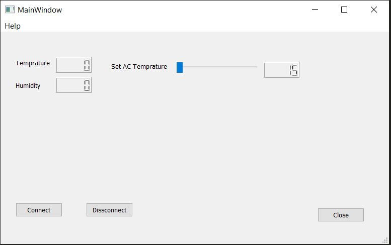

# Home Automation
Basic demo for creating home automation system using MQTT, Arduino and PyQt

## Introduction

### MQTT
MQTT is a very light weight publish subscriber based protocol which basically runs over TCP/IP. It was developed by IBM.

Offical site link: mqtt.org


### Arduino
Arduino is an open-source hardware and software company, project and user community that designs and manufactures single-board microcontrollers and microcontroller kits for building digital devices.


### PyQt
PyQt is a Python binding of the cross-platform GUI toolkit Qt, implemented as a Python plug-in. PyQt is free software developed by the British firm Riverbank Computing.


## Implementation

Please refer to README in each folder.

[Arduino](Arduino/README.md)

[Qt](Qt/README.md)

[Python](Script/README.md)


To run the project directly:

Terminal 1:
```
$cd Script/
$python ./dummy_sender
```

Terminal 2:
```
$cd Script/
$python ./UI_Demo
```

GUI:


